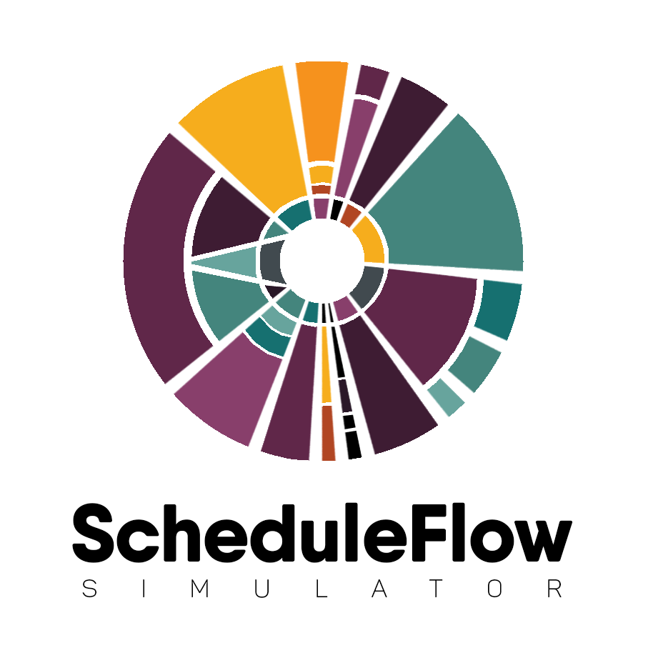
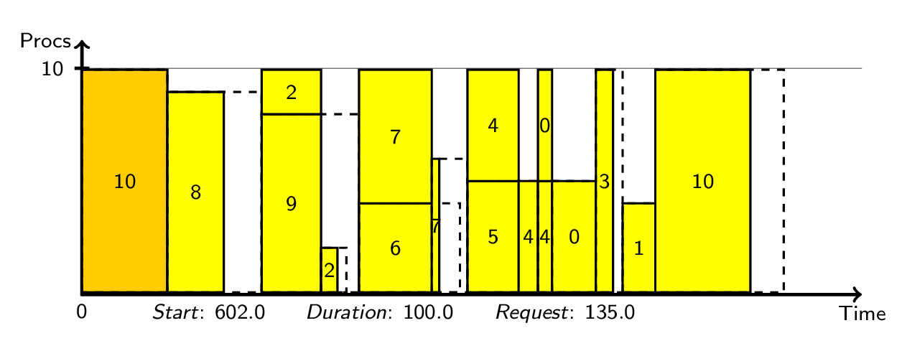
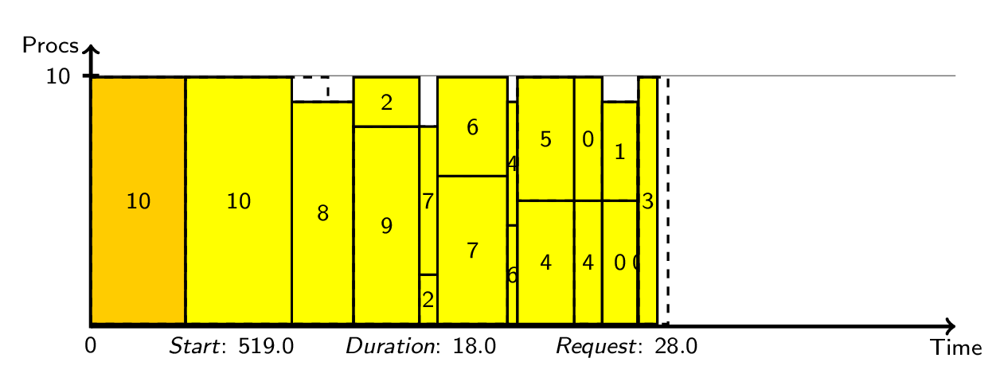

# Simulator for HPC schedulers

[]( https://g.codefresh.io/public/accounts/anagainaru_marketplace/pipelines/anagainaru/SchedulerSimulator/SchedulerSimulator)
[](https://codecov.io/gh/anagainaru/SchedulerSimulator)

The ScheduleFlow software consists of a series of scripts and classes that offer an API allowing users to create simulation scenarios for online and reservation-based batch schedulers.
For details on the API or the internals of the Simulator, visit the [wiki](https://github.com/anagainaru/SchedulerSimulator/wiki)

### Citation

If you use the package available here in your work, please refer to the latest release. 

[](https://zenodo.org/badge/latestdoi/179132255)

### Usage

Copy the latest release ... TODO

### Example

`python run_simple_example.py`

<sup>* Tested with python 3.7</sup>

**Requirements** 

<pre>
Generating GIFs for simulations requires <b>pdflatex</b> and <b>convert</b> from ImageMagick.
</pre>

**Details**

The script simulates the execution of 11 jobs submitted to 
a reservation-based scheduler and an online scheduler.

The simulation assumes a system of 10 processing units.

The workload used consists of:

- 10 jobs with randon execution times
  (requesting larger execution times than needed) and random
  processing unit requirements. 
- one large job running on almost the entire machine and for
  large units of time (equesting less time than it needs to 
  complete successfully)

The simulation can check for correctness, generate an animation
of the scheduling process and output the results to a file or 
to stdout. Declaring a new Simulation object:

```python
simulator = Simulator.Simulator(check_correctness=True,
                                generate_gif=True,
                                output_file_handler=sys.stdout)

```

To start a simulation a scenario needs to be created for a 
given simulation:

```python
scheduler = Scheduler.BatchScheduler(system)
simulator.create_scenario(scenario_name,
                          scheduler,
                          job_list=job_list)
simulator.run()
```

The scenario uses a scheduler and a list of jobs that need to be
simulated. In addition, jobs can be added to a scenario by using
the `simulator.add_applications(job_list)` method. Alternatively,
the run_scenario method can be called directly on the simulator:

```python
simulator.run_scenario(scenario_name, scheduler, job_list)
```

The scenario name is used to create the animation GIF filenames
and for debugging purposes. The resubmit factor indicates that 
failed jobs need to be resubmitted with an execution time increase
given by the facor. By default, failed jobs are not resubmitted.

The GIF generation is controled by the VizEngine class. It uses the
`tex_header` and `tex_footer` files in the ./draw directory to 
generate tex files for every step of the animation. Pdflatex is used
fo create PDF files which are used by ImageMagick to generate the GIF.

**Output**

If successfuly ran, the `run_simple_example.py` script will output <sup>*</sup>:

<pre>
Scenario : makespan : utilization : average_job_utilization : average_job_response_time : average_job_stretch : average_job_wait_time : failures
test_batch : 526.00 : 0.54 : 0.70 : 291.55 : 8.76 : 209.50 : 1
test_online : 421.00 : 0.67 : 0.70 : 285.91 : 8.96 : 204.33 : 1
GIFs generated in ./draw/test_{batch, online}.gif
</pre>

Example GIFs generated:

Reservation-based scheduler simulation



Reservation-based scheduler simulation



<sup>* Depeding on the requirements of the jobs, the scheduler might give
other execution orders for the submitted jobs and thus slightly different performance values</sup>

